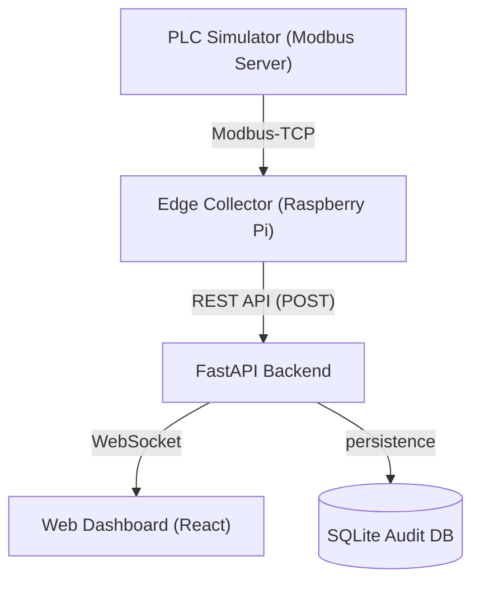

# Gas Safety PLC Monitoring System (가스 설비 안전 모니터링 시스템) 🛡️

현장 가스 설비의 안전을 실시간으로 감시하고, 위험 상황 시 자동 차단(Interlock) 및 이력을 관리하는 통합 모니터링 시스템입니다.

---

##  Key Features (주요 기능)

### 1. Gas Safety Simulation (가스 안전 시뮬레이션)
- **Realistic Data Generation**: 5 PPM 내외의 안정적인 평상시 상태와 무작위로 발생하는 가스 누출(Leak) 시나리오를 시뮬레이션합니다.
- **Auto-Interlock Logic**: 가스 농도가 40 PPM을 초과하면 **Interlock Valve가 즉시 차단**되며, 시스템 상태가 **FAULT**로 전환됩니다.
- **Recovery Cycle**: 가스 농도가 낮아진 후 15초가 지나면 현장 리셋을 가정하여 자동으로 **NORMAL** 상태로 복구됩니다.

### 2. Edge & Backend Architecture (데이터 흐름)
- **Edge Collector**: 라즈베리파이 역할을 수행하며 Modbus-TCP를 통해 PLC 데이터를 2초 간격으로 폴링(Polling)하고 서버로 전송합니다.
- **Real-time Synchronization**: **WebSockets**를 사용하여 서버에서 처리된 데이터를 웹 대시보드로 지연 없이 실시간 방송(Broadcast)합니다.
- **Safety Audit Log**: 모든 센서 값과 밸브 상태 변화를 SQLite DB에 저장하여 사후 사고 분석이 가능합니다.

### 3. Safety-First Web UI (안전 중심 대시보드)
- **High-Visibility Banner**: 가스 차단 시 화면 상단에 붉은색 사이렌 배너가 고정되어 즉각적인 인지가 가능합니다.
- **State-First Display**: 복잡한 수치보다 **NORMAL / WARNING / ALARM** 상태를 우선적으로 시각화합니다.
- **No-Control Policy**: 보안 및 안전을 위해 웹 사이트에서는 제어 버튼을 배제하고 오직 **Read-only Monitoring**만 제공합니다.

### 4. CI/CD Deployment (자동 배포)
- **GitHub Actions**: 코드를 `main` 브랜치에 푸시하면 자동으로 React 빌드 및 GitHub Pages 배포가 진행됩니다.

---

## 🛠 Tech Stack (기술 스택)

- **Frontend**: React, Vite, Vanilla CSS
- **Backend**: FastAPI (Python), WebSocket, SQLite
- **Edge/Sim**: Python, pyModbusTCP
- **Deployment**: GitHub Actions, GitHub Pages

---

## 🏗 System Architecture (시스템 구조)



---

## ⚙️ How to Run (실행 방법)

### 1. Backend & DB 설정
```bash
cd server
python -m uvicorn main:app --reload --port 8000
```

### 2. PLC 시뮬레이터 실행
```bash
cd sim
python plc_simulator.py
```

### 3. Edge 수집기 실행
```bash
cd edge
python collector.py
```

### 4. Frontend 개발 서버
```bash
cd client
npm run dev
```

---

## 🌐 Live Demo
배포된 대시보드는 아래 주소에서 확인하실 수 있습니다:
👉 [https://srunaic.github.io/sensor_plc_rasberrypie-/](https://srunaic.github.io/sensor_plc_rasberrypie-/)

*(주의: 실시간 데이터 반영을 위해서는 로컬 또는 별도 서버에서 Backend와 Collector가 실행 중이어야 합니다.)*
